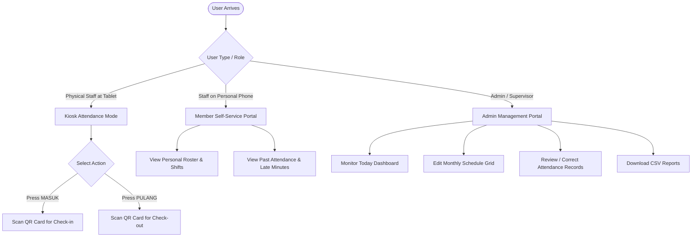
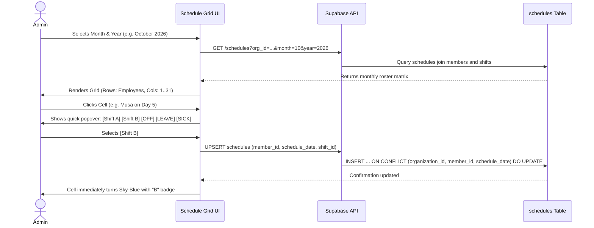
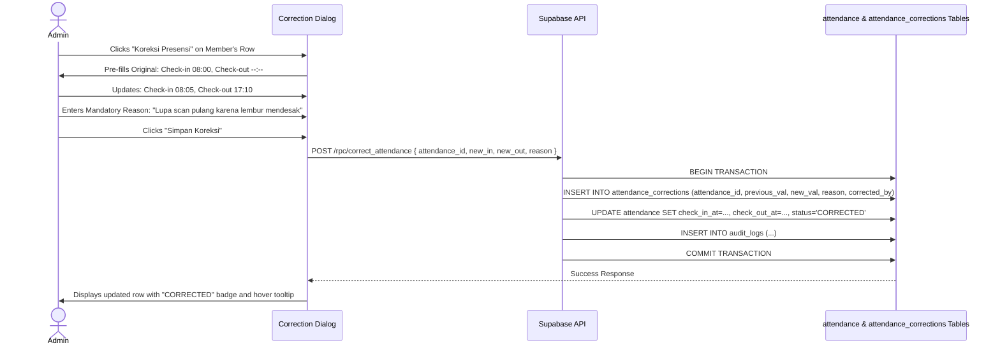

# 04_SYSTEM_FLOW.md — System Flow & Business Process Specifications

**Document Version:** 1.0  
**Scope:** Interactive & Automated Workflows for Member Mode, Kiosk Scanning, and Admin Operations  

---

## 1. High-Level User Journey Overview



---

## 2. Kiosk Attendance & QR Scan Flow (Front Camera)

### 2.1 Complete Scan Lifecycle

```mermaid
sequenceDiagram
    autonumber
    actor Staff as Member / Staff
    participant Kiosk as Tablet Kiosk (PWA)
    participant Cam as Front-Facing Camera
    participant API as Backend RPC (record_attendance_scan)
    participant DB as PostgreSQL Database

    Staff->>Kiosk: Taps [ MASUK ] or [ PULANG ]
    Kiosk->>Cam: Initializes front video stream (mirrored)
    Cam-->>Kiosk: Live preview feed rendered
    Staff->>Cam: Holds physical QR badge in front of lens
    Kiosk->>Kiosk: Local video frame decoded (HTML5 QR Scanner)
    Kiosk->>API: POST /rpc/record_attendance_scan { token, action }
    
    Note over API,DB: Server-side validation & atomic clock verification
    API->>DB: Query active QR token & member profile
    alt QR not found or revoked
        DB-->>API: Status: INVALID_QR
        API-->>Kiosk: 400 { success: false, code: "INVALID_QR" }
        Kiosk->>Staff: Display gentle alert: "QR tidak dikenali"
    else Member is inactive
        DB-->>API: Status: INACTIVE_MEMBER
        API-->>Kiosk: 403 { success: false, code: "INACTIVE_MEMBER" }
        Kiosk->>Staff: Display alert: "Status karyawan tidak aktif"
    else Valid Member & Active Token
        API->>DB: Check today's schedule & duplicate rules
        alt Action is MASUK and already checked in today
            DB-->>API: Existing check_in_at found
            API-->>Kiosk: 409 { success: false, code: "DUPLICATE_CHECK_IN" }
            Kiosk->>Staff: Friendly feedback: "Sudah tercatat hari ini"
        alt Action is PULANG and no check-in exists
            DB-->>API: No check_in_at found today
            API-->>Kiosk: 400 { success: false, code: "NO_CHECK_IN_FOUND" }
            Kiosk->>Staff: Friendly warning: "Belum bisa pulang (Belum ada catatan masuk)"
        alt Action is PULANG and already checked out
            DB-->>API: Existing check_out_at found
            API-->>Kiosk: 409 { success: false, code: "DUPLICATE_CHECK_OUT" }
            Kiosk->>Staff: Feedback: "Sudah tercatat pulang sebelumnya"
        else Validation Passed
            API->>DB: INSERT / UPDATE attendance with server NOW()
            DB-->>API: Row updated successfully
            API-->>Kiosk: 200 { success: true, member_name, timestamp, status }
            Kiosk->>Staff: Cheerful Success Modal (Mascot jumps, sound chime)
            Note over Kiosk: Auto-resets camera to home state in 3 seconds
        end
    end
```

---

## 3. Detailed Check-In & Check-Out Business Rules

### 3.1 Check-In (MASUK) Evaluation Matrix

When a member presents a card for `MASUK`:

```mermaid
flowchart TD
    A[Token Received] --> B{Token Active in DB?}
    B -- No --> B_Err[Return INVALID_QR: "Kartu tidak dikenali"]
    B -- Yes --> C{Member Status Active?}
    C -- No --> C_Err[Return INACTIVE_MEMBER: "Karyawan non-aktif"]
    C -- Yes --> D{Today's Schedule Type?}
    
    D -- OFF / LEAVE / HOLIDAY --> D_Rest[Prompt: "Hari ini dijadwalkan libur/cuti"]
    D -- SHIFT Assigned --> E{Already Checked In Today?}
    
    E -- Yes --> E_Dup[Return DUPLICATE_CHECK_IN: "Sudah tercatat masuk pukul HH:MM"]
    E -- No --> F[Compare Server Time vs Shift Start Time]
    
    F --> G{Actual Time vs Start Time}
    G -- "Time <= Start + LateTolerance" --> H[Mark Status: PRESENT, Late = 0]
    G -- "Time > Start + LateTolerance" --> I[Mark Status: LATE, Calculate late_minutes]
    G -- "Time < Start - EarlyTolerance" --> J[Record early arrival, Flag note]
    
    H & I & J --> K[Commit INSERT to attendance table atomically]
    K --> L[Emit Success UI Response with Member Name & Server Time]
```

### 3.2 Check-Out (PULANG) Evaluation Matrix

```mermaid
flowchart TD
    A1[Token Received for PULANG] --> B1{Token & Member Valid?}
    B1 -- No --> B1_Err[Reject Invalid Token / Inactive Member]
    B1 -- Yes --> C1{Check-in Row Exists Today?}
    
    C1 -- No --> C1_Err[Return NO_CHECK_IN_FOUND: "Belum ada data masuk hari ini"]
    C1 -- Yes --> D1{Already Checked Out Today?}
    
    D1 -- Yes --> D1_Dup[Return DUPLICATE_CHECK_OUT: "Sudah presensi pulang pada HH:MM"]
    D1 -- No --> E1[Calculate Total Work Duration: NOW() - check_in_at]
    
    E1 --> F1{Actual Time vs Scheduled Shift End}
    F1 -- "Time < Scheduled End" --> G1[Early Departure: Note difference]
    F1 -- "Time >= Scheduled End" --> H1[Standard / Overtime duration noted]
    
    G1 & H1 --> I1[Commit UPDATE to attendance table atomically]
    I1 --> J1[Emit Friendly Goodbye Modal with Total Hours Worked]
```

---

## 4. Admin Monthly Schedule Flow

Admins assign and modify shifts using an interactive spreadsheet-style grid (`/admin/schedule`):



---

## 5. Anti-Proxy Review & Attendance Correction Flow

### 5.1 Anti-Proxy Review Workflow
Because physical QR cards could theoretically be scanned by a coworker (proxy attendance):
1. **Detection:** Admin or supervisor notices an attendance record that appears suspicious (e.g., scan time mismatch or employee was reported absent).
2. **Review Queue:** Admin opens `/admin/attendance?filter=flagged` or clicks "Review" on any row.
3. **Action:**
   - Mark as **VERIFIED**: Confirms attendance was legitimate.
   - Mark as **FLAGGED_INVALID**: Attendance is flagged as proxy/invalid, status updated to `REVIEW_REQUIRED`, reason recorded.
4. **Non-Destructive:** The database **never deletes** the row. The original check-in timestamp remains intact with a `review_status = 'FLAGGED_INVALID'` flag and administrative remarks for historical auditability.

### 5.2 Attendance Manual Correction Flow



---

## 6. Error & Edge Case State Handling

| Scenario | System Behavior | UI / User Feedback |
|---|---|---|
| **Front Camera Denied** | System catches `NotAllowedError` | Displays instructional dialog: *"Izinkan akses kamera di pengaturan browser untuk memindai kartu QR."* |
| **Network Disconnected** | Kiosk detects `navigator.onLine === false` | Disables scan button, displays yellow banner: *"Koneksi internet terputus. Menunggu sinyal..."* |
| **Rapid Double Scan (< 5s)** | Frontend throttles duplicate token reads; Backend rejects second atomic scan | Prevents spamming; displays: *"Presensi Anda baru saja dicatat!"* |
| **Lost QR Card** | Admin clicks "Revoke QR" in Member directory | Old token immediately rejected (`INVALID_QR`). New QR token generated and printed in seconds. |
| **Scan on Unscheduled Day** | System checks `schedules` table; if no record found, assigns organization's default primary shift or alerts admin | Configurable: default allows check-in as unassigned shift or flags for review. |
| **Overnight Shift (e.g. 21:00 - 06:00)** | Backend computes schedule date based on shift start date, handling midnight cross cleanly | Check-out at 06:05 links properly to the prior evening's check-in row. |
