# 📸 Dokumentasi Tangkapan Layar (Screenshots) — Absence System

Folder ini berisi dokumentasi visual lengkap dan mendalam dari seluruh fitur, modal dialog, alur presensi, panel administrator, dan responsivitas tablet/mobile aplikasi **Absence (Sistem Presensi QR Karyawan - Calm Tactile UI)**.

---

## 📑 Daftar Isi Tangkapan Layar

| No | File | Fitur / Layar | Resolusi / Mode |
|---|---|---|---|
| 00 | [`00_setup_aktivasi_perangkat.png`](./00_setup_aktivasi_perangkat.png) | Setup & Otorisasi Tablet Pertama Kali | Desktop (1440×900) |
| 01 | [`01_kiosk_presensi_masuk.png`](./01_kiosk_presensi_masuk.png) | Layar Kiosk Presensi Masuk (Idle) | Desktop (1440×900) |
| 02 | [`02_kiosk_presensi_pulang.png`](./02_kiosk_presensi_pulang.png) | Mode Presensi Pulang Kerja | Desktop (1440×900) |
| 03 | [`03_kiosk_scan_berhasil_feedback.png`](./03_kiosk_scan_berhasil_feedback.png) | Kartu Feedback Presensi Berhasil + Confetti | Desktop (1440×900) |
| 04 | [`04_kiosk_tablet_portrait_ipad.png`](./04_kiosk_tablet_portrait_ipad.png) | Tampilan Kiosk iPad / Tablet Portrait | Tablet (768×1024) |
| 05 | [`05_modal_admin_security_gate.png`](./05_modal_admin_security_gate.png) | Dialog Kunci Keamanan PIN/Password Admin | Modal Overlay |
| 06 | [`06_admin_monitoring_hari_ini.png`](./06_admin_monitoring_hari_ini.png) | Admin — Monitoring Kehadiran Real-Time | Desktop (1440×900) |
| 07 | [`07_admin_data_karyawan_list.png`](./07_admin_data_karyawan_list.png) | Admin — Manajemen Staf & Status QR | Desktop (1440×900) |
| 08 | [`08_admin_modal_tambah_karyawan.png`](./08_admin_modal_tambah_karyawan.png) | Modal Form Pendaftaran Karyawan Baru | Modal Overlay |
| 09 | [`09_admin_modal_qr_identity_card.png`](./09_admin_modal_qr_identity_card.png) | Modal Kartu ID Card & QR Cetak Staf | Modal Overlay |
| 10 | [`10_admin_matriks_jadwal_mingguan.png`](./10_admin_matriks_jadwal_mingguan.png) | Admin — Matriks Jadwal Shift Bulanan | Desktop (1440×900) |
| 11 | [`11_admin_shift_kerja_toleransi.png`](./11_admin_shift_kerja_toleransi.png) | Admin — Konfigurasi Shift Kerja & Toleransi | Desktop (1440×900) |
| 12 | [`12_admin_modal_tambah_shift.png`](./12_admin_modal_tambah_shift.png) | Modal Form Tambah / Edit Shift Kerja | Modal Overlay |
| 13 | [`13_admin_log_audit_presensi.png`](./13_admin_log_audit_presensi.png) | Admin — Log Riwayat & Audit Anti-Joki | Desktop (1440×900) |
| 14 | [`14_admin_laporan_ekspor_csv.png`](./14_admin_laporan_ekspor_csv.png) | Admin — Laporan Analitik & Ekspor CSV Payroll | Desktop (1440×900) |
| 15 | [`15_admin_pengaturan_organisasi.png`](./15_admin_pengaturan_organisasi.png) | Admin — Pengaturan Cabang & Backend | Desktop (1440×900) |
| 16 | [`16_admin_smartphone_responsive.png`](./16_admin_smartphone_responsive.png) | Admin — Tampilan Responsif Layar Handphone | Mobile (390×844) |

---

## 🔍 Detail Rinci Setiap Tampilan

### 00. Setup & Otorisasi Tablet Pertama Kali
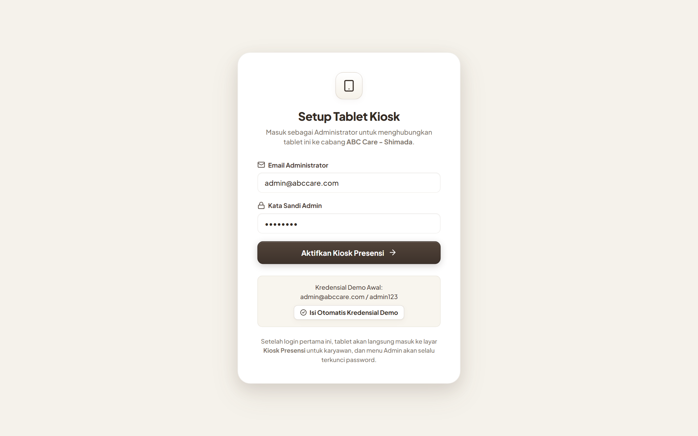
- **Tujuan**: Mengamankan perangkat tablet saat pertama kali dinyalakan di cabang/lokasi kerja.
- **Elemen Penting**:
  - Form otorisasi admin cabang (Email Administrator & Kata Sandi).
  - Shortcut kredensial demo (`admin@abccare.com` / `admin123`).
  - Setelah aktivasi, tablet langsung beralih ke Kiosk Presensi dan memproteksi pengaturan admin dengan PIN.

---

### 01. Mode Kiosk Presensi Masuk (Idle)
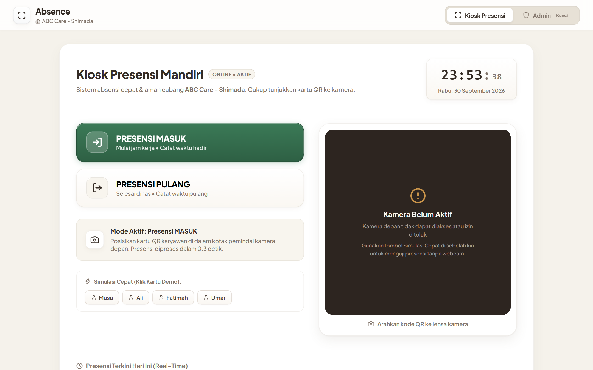
- **Tujuan**: Layar siaga utama saat tablet dipasang di meja resepsionis/pintu masuk kantor.
- **Elemen Penting**:
  - **Jam Digital Skeuomorphic**: Display jam, menit, detik dan tanggal hari ini.
  - **Tombol Taktil Presensi Masuk**: Berwarna hijau forest (`#3B7A57`) dengan status aktif empuk.
  - **Status Card**: Indikator instruksi jarak scan kartu QR (respon 0.3 detik).
  - **Simulasi Kartu Staf**: Tombol cepat untuk pengujian presensi instan tanpa webcam.
  - **Frame Kamera Laser**: Bezel pemindai QR kamera depan dengan reticle sudut.
  - **Riwayat Presensi Terkini**: Tabel ringkas kehadiran staf hari ini di bagian bawah.

---

### 02. Mode Kiosk Presensi Pulang

- **Tujuan**: Digunakan karyawan saat jam kerja berakhir untuk mencatat jam keluar dinas.
- **Elemen Penting**:
  - Tombol **PRESENSI PULANG** beralih aktif dengan warna terakota hangat (`#C86D51`).
  - Kamera otomatis mengarahkan pencatatan ke kolom `check_out_at` pada database.

---

### 03. Kartu Feedback Presensi Berhasil + Confetti
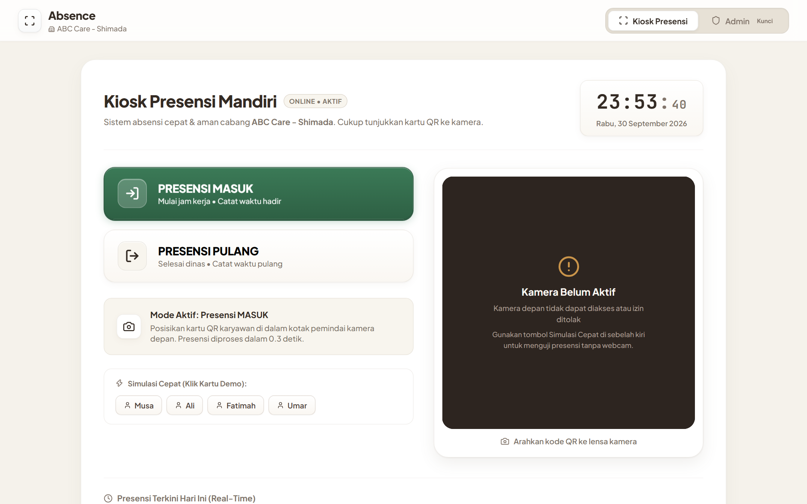
- **Tujuan**: Memberikan konfirmasi visual dan audio instan kepada staf bahwa absensi sukses.
- **Elemen Penting**:
  - Animasi partikel konfeti perayaan kehadiran.
  - Kartu hijau taktil dengan icon centang timbul, nama staf (`Musa Al-Fatih`), pesan `"Presensi masuk berhasil dicatat!"`, dan timestamp server.
  - Auto-reset kembali ke mode siaga dalam 3 detik untuk antrean staf berikutnya.

---

### 04. Tampilan Kiosk iPad / Tablet Portrait (768×1024)
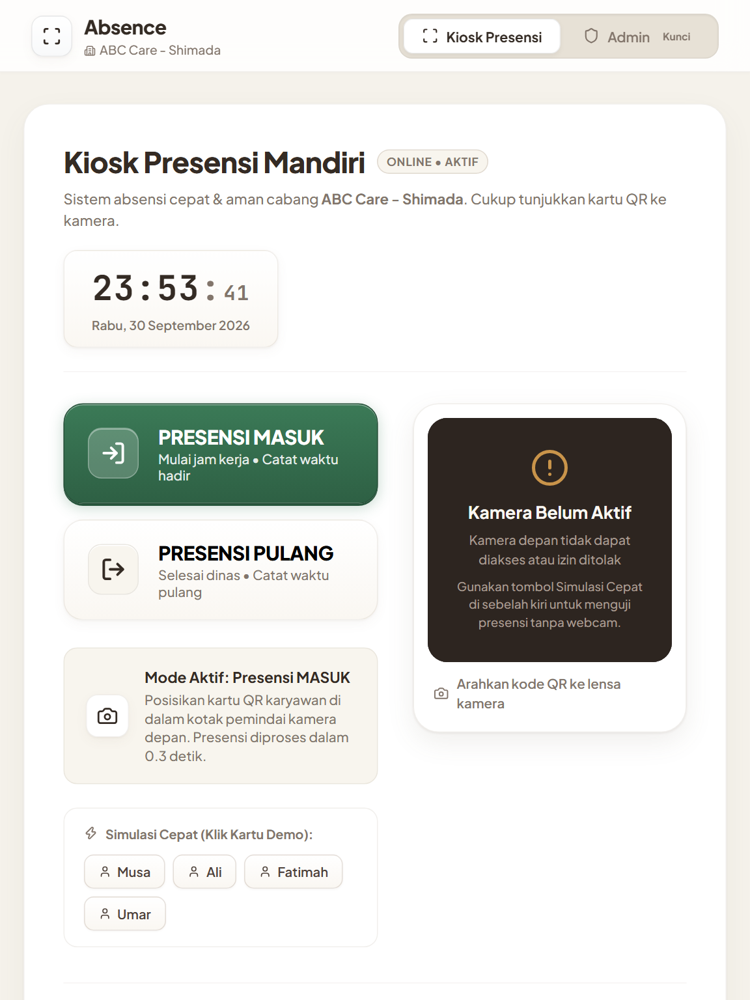
- **Tujuan**: Layout yang dioptimalkan khusus saat tablet dipasang tegak (portrait stand).
- **Elemen Penting**:
  - Kolom kontrol aksi presensi dan viewfinder kamera tersusun vertikal secara proporsional.
  - Tombol-tombol berukuran besar (touch-friendly minimum 48px) ramah jari tangan.

---

### 05. Dialog Kunci Keamanan PIN/Password Admin
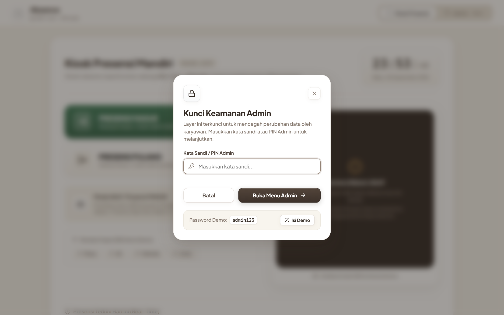
- **Tujuan**: Mencegah karyawan iseng atau orang luar mengubah data presensi di tablet.
- **Elemen Penting**:
  - Input field sandi dengan ikon kunci.
  - Fitur Isi Demo otomatis untuk pengujian cepat.
  - Backdrop blur lembut (glassmorphism skeuomorphic).

---

### 06. Admin — Monitoring Kehadiran Real-Time
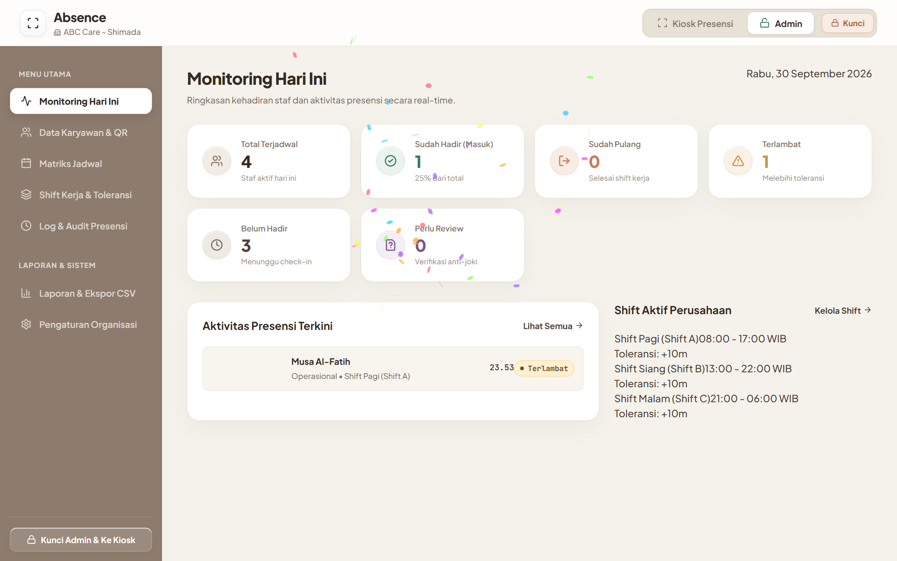
- **Tujuan**: Dashboard pengawas untuk manajer/HR melihat status kehadiran staf hari ini secara langsung.
- **Elemen Penting**:
  - **4 Metrik Utama**: Total Terjadwal (4), Sudah Hadir (1), Sudah Pulang (0), Terlambat (1).
  - **Aktivitas Terkini**: Daftar nama staf yang baru saja melakukan scan dengan status (Tepat Waktu / Terlambat).
  - **Shift Aktif Perusahaan**: Ringkasan jam kerja Shift Pagi, Shift Siang, dan Shift Malam beserta toleransinya.
  - **Tombol Kunci Cepat**: Tombol di pojok kiri bawah untuk langsung mengunci kembali tablet ke mode Kiosk.

---

### 07. Admin — Manajemen Staf & Status QR
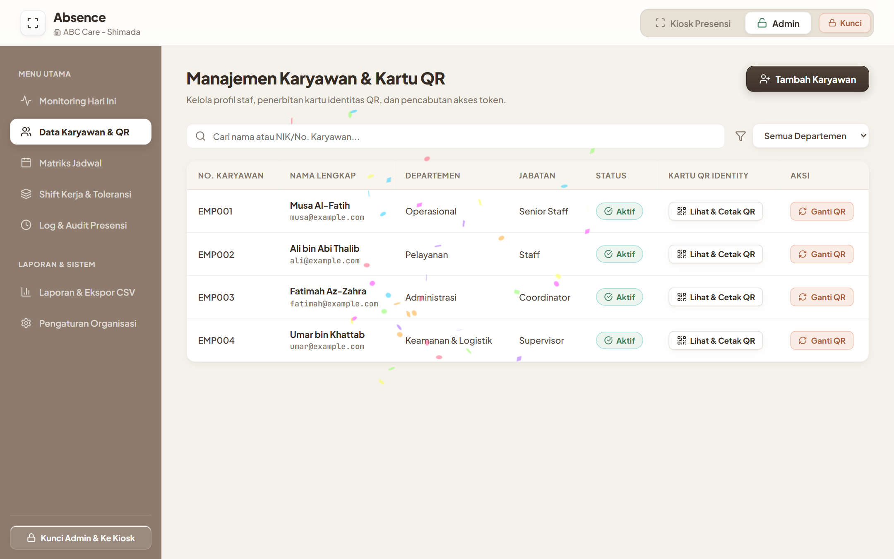
- **Tujuan**: Mengelola seluruh database karyawan kantor.
- **Elemen Penting**:
  - Tabel staf lengkap: Nomor Karyawan (NIK), Nama Lengkap, Departemen, Jabatan, dan Status Aktif/Non-Aktif.
  - Fitur pencarian real-time dan filter departemen.
  - Tombol **Lihat & Cetak QR** dan tombol **Ganti QR** (cabut token lama dan terbitkan token baru anti-duplikasi).

---

### 08. Modal Form Pendaftaran Karyawan Baru
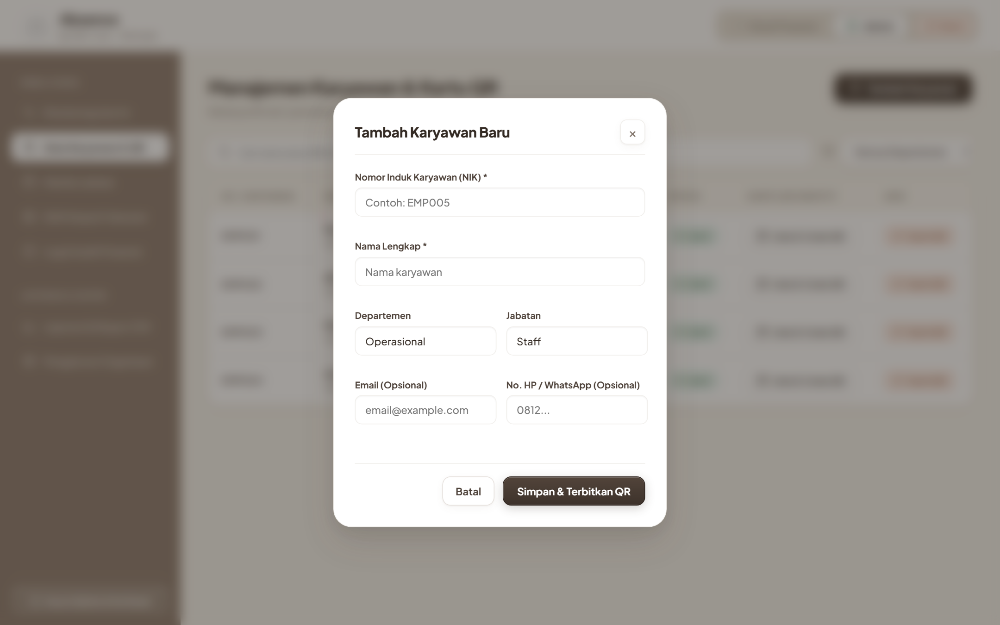
- **Tujuan**: Input data pegawai baru secara cepat.
- **Elemen Penting**:
  - Input Nomor Induk Karyawan (NIK), Nama Lengkap, Departemen, Jabatan, Email, dan No. HP/WhatsApp.
  - Tombol "Simpan & Terbitkan QR" yang langsung membuat token unik QR code.

---

### 09. Modal Kartu ID Card & QR Cetak Staf
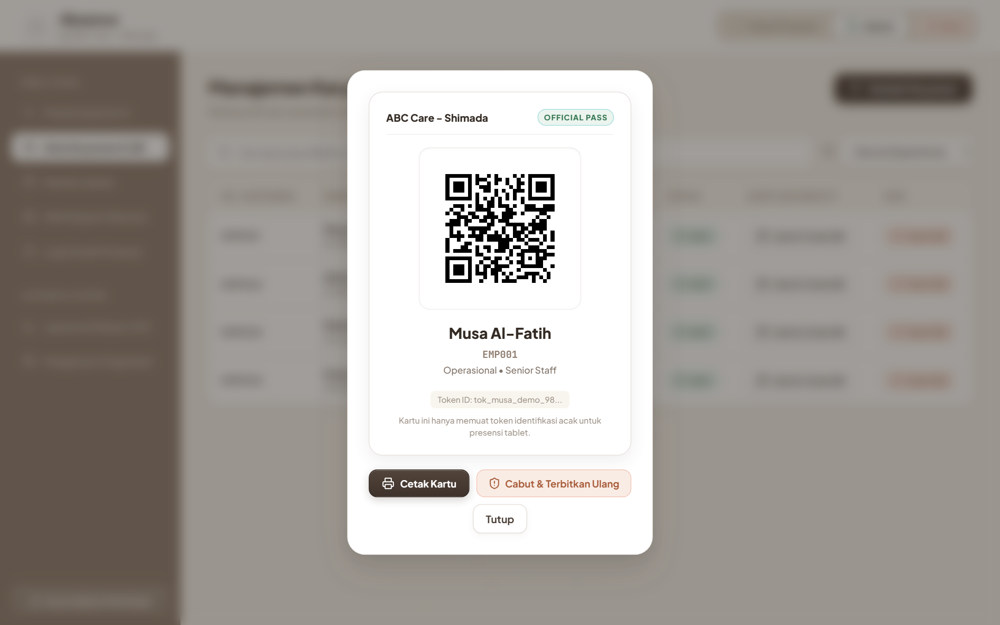
- **Tujuan**: Menampilkan badge identitas resmi karyawan dengan QR code beresolusi tinggi.
- **Elemen Penting**:
  - Header badge resmi `"ABC Care - Shimada • OFFICIAL PASS"`.
  - QR Code SVG berbasis vektor tajam (tidak pecah saat dicetak).
  - Tombol **Cetak Kartu** (langsung membuka dialog print thermal/A4) dan **Cabut & Terbitkan Ulang**.

---

### 10. Admin — Matriks Jadwal Shift Bulanan
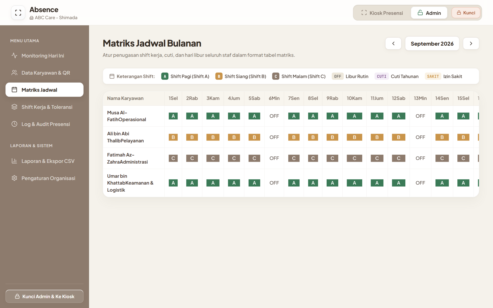
- **Tujuan**: Penjadwalan kerja bergilir (roster) seluruh staf selama satu bulan penuh.
- **Elemen Penting**:
  - Navigasi bulan & tahun.
  - Legenda badge shift: Shift A (Hijau), Shift B (Cokelat), Shift C (Abu-abu), Libur Rutin (OFF), Cuti Tahunan (CUTI), Izin Sakit (SAKIT).
  - Grid interaktif di mana admin bisa klik tiap sel tanggal untuk mengganti penugasan staf.

---

### 11. Admin — Konfigurasi Shift Kerja & Toleransi
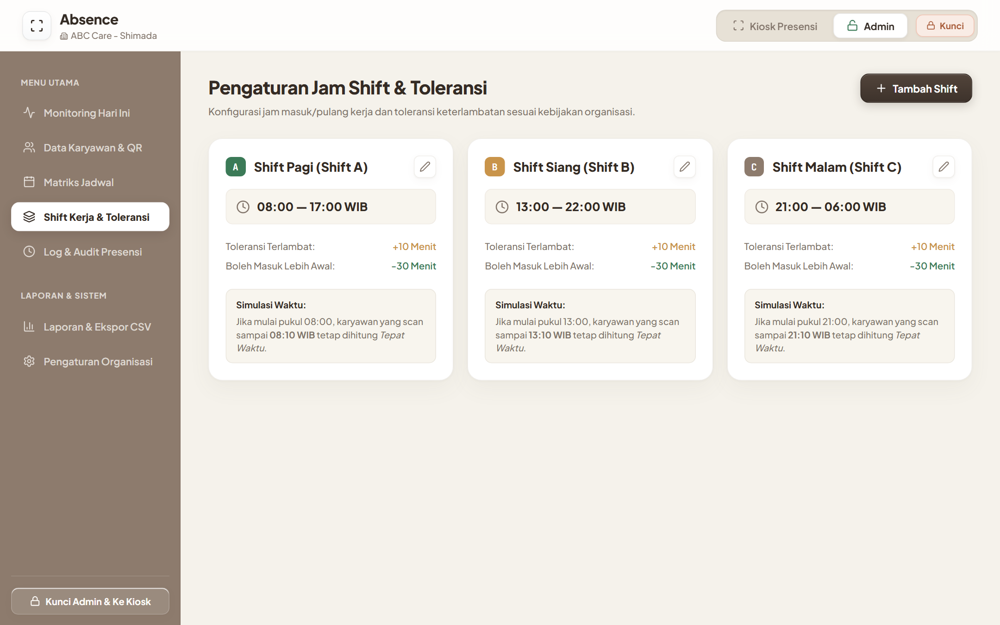
- **Tujuan**: Mengatur kebijakan waktu kerja perusahaan.
- **Elemen Penting**:
  - Kartu konfigurasi Shift Pagi (08:00 - 17:00), Shift Siang (13:00 - 22:00), Shift Malam (21:00 - 06:00).
  - Pengaturan batas **Toleransi Terlambat** (misal +10 menit) dan **Boleh Masuk Lebih Awal** (misal -30 menit).
  - Simulasi kalkulasi otomatis status presensi.

---

### 12. Modal Form Tambah / Edit Shift Kerja
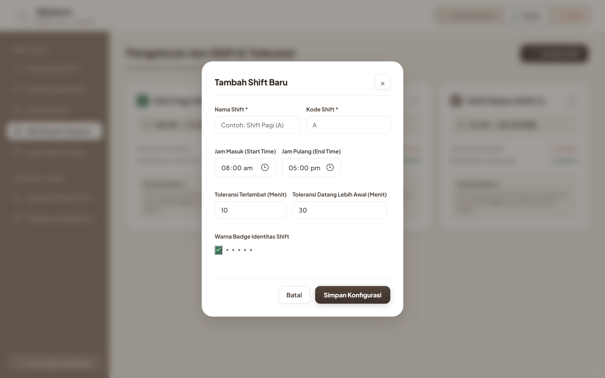
- **Tujuan**: Membuat jam kerja baru (misal Shift Khusus Ramadan, Shift Lembur, atau Shift Event).
- **Elemen Penting**:
  - Input Nama Shift, Kode Huruf Singkat, Jam Masuk, Jam Pulang, dan Menit Toleransi Keterlambatan.
  - Pilihan palet warna badge identitas shift.

---

### 13. Admin — Log Riwayat & Audit Anti-Joki
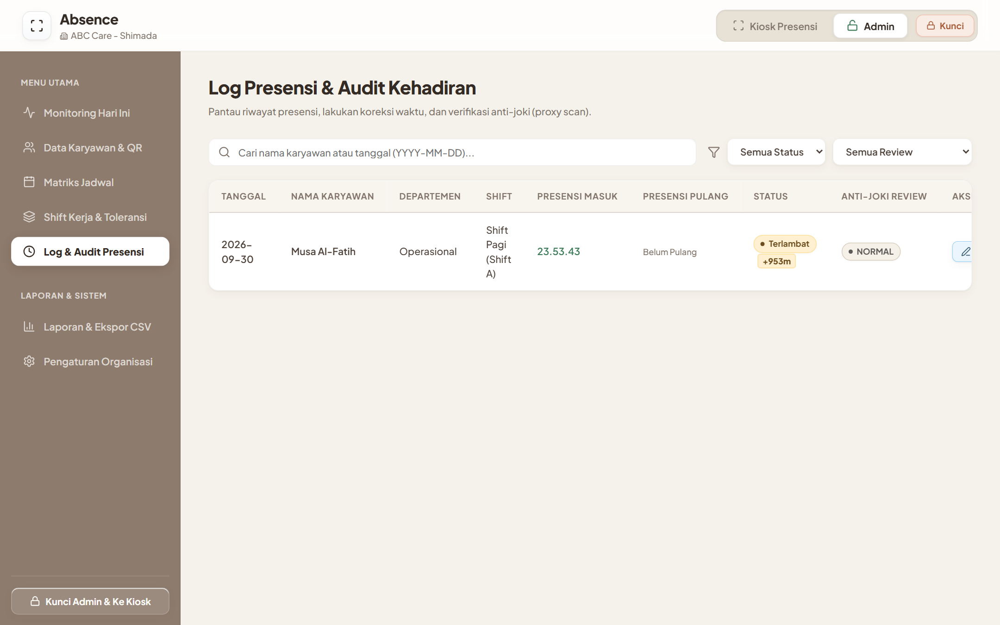
- **Tujuan**: Rekam jejak audit presensi setiap hari untuk akuntabilitas.
- **Elemen Penting**:
  - Menampilkan tanggal, nama staf, departemen, shift, jam presensi masuk, jam presensi pulang.
  - Badge status kehadiran (`Tepat Waktu`, `Terlambat +950m`).
  - Indikator verifikasi audit anti-joki (`NORMAL`).
  - Tombol edit manual untuk koreksi jam presensi jika staf lupa scan.

---

### 14. Admin — Laporan Analitik & Ekspor CSV Payroll
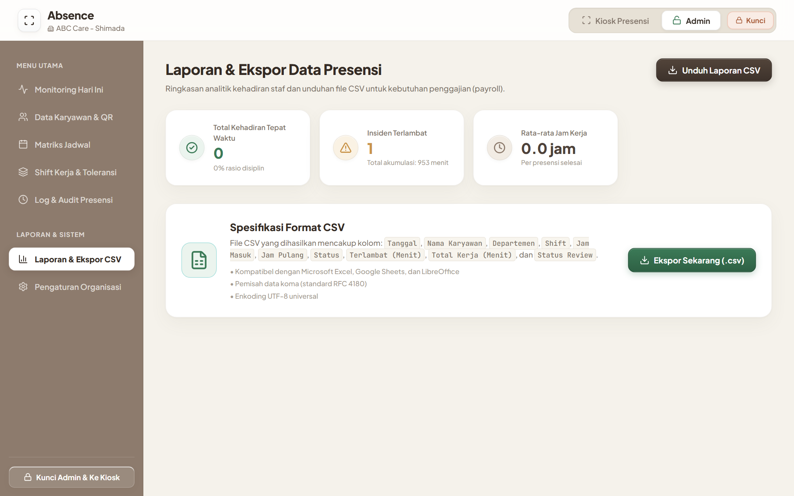
- **Tujuan**: Membantu HR mengekspor data absensi ke aplikasi payroll atau spreadsheet.
- **Elemen Penting**:
  - Kartu metrik rekapitulasi: Total Tepat Waktu, Insiden Terlambat, dan Rata-rata Jam Kerja.
  - Spesifikasi format file CSV (kompatibel Microsoft Excel, Google Sheets, LibreOffice, pemisah koma RFC 4180).
  - Tombol **Ekspor Sekarang (.csv)**.

---

### 15. Admin — Pengaturan Cabang & Backend
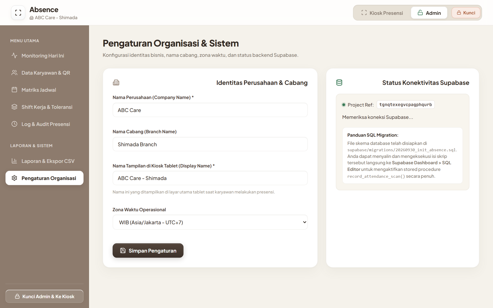
- **Tujuan**: Mengatur profil instansi dan integrasi database cloud.
- **Elemen Penting**:
  - Pengaturan Nama Perusahaan, Nama Cabang (`Shimada Branch`), dan Nama Tampilan di Kiosk Tablet.
  - Pemilihan Zona Waktu Operasional (WIB / WITA / WIT).
  - Status koneksi Supabase cloud dan panduan migrasi SQL.

---

### 16. Admin — Tampilan Responsif Layar Handphone (390×844)
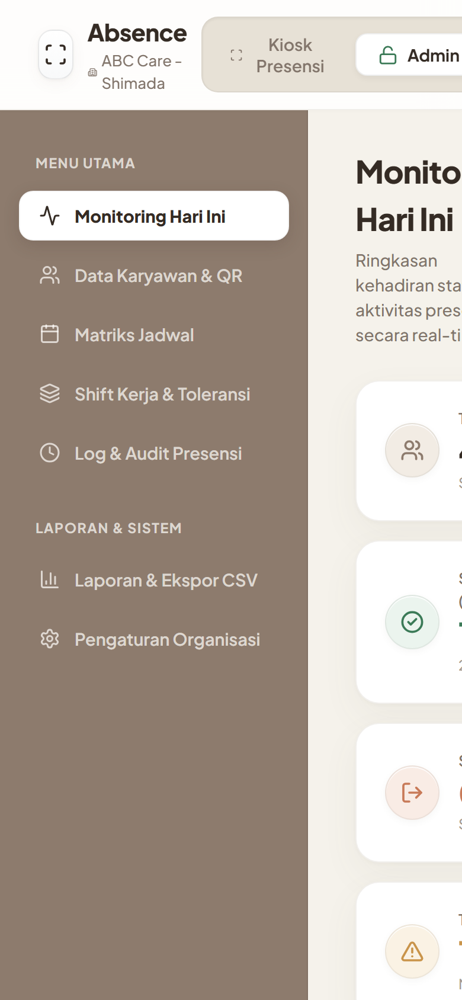
- **Tujuan**: Memastikan admin atau pimpinan cabang dapat membuka panel monitoring melalui smartphone mereka.
- **Elemen Penting**:
  - Navigasi dan kartu metrik yang mengalir mulus tanpa scroll horizontal yang merusak layout.
